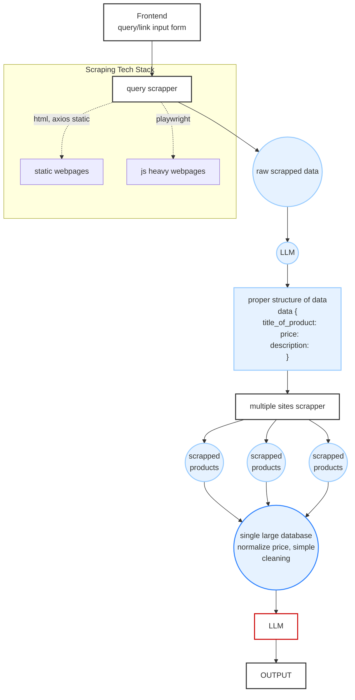

### This is the backend codebase for the arly-local market intelligence webapp

First off lets understand how our backend structure works:

---

## Backend Focus Areas (from product scrapper - `prod_sc` & query scrapper- `query_sc`)

here are the areas gonna be covered in this repo

### [inprogress] URL-Based Product Extraction (`query_sc/`)
- Playwright pipeline for JS-heavy sites (Daraz, SastoDeal) — waits for price/h1, 5s timeout
- Axios/cheerio pipeline for static sites — 10s timeout, 5 redirects, spoofed User-Agent
- Priority extraction: JSON-LD (`script[type="application/ld+json"]`) → OG meta → raw text fallback
- **Check:** Timeout handling, retry logic (2 max), 

### [upnext] LLM Structured Extraction
- **Model:** Gemini 1.5 Flash
- **Schema:** `product_name`, `brand`, `category`, `key_specs`, `current_price`, `original_price`, `availability`, `search_queries`
- **Categories:** smartphone, laptop, appliance, clothing, grocery, cosmetics, electronics, furniture, beauty, sports, books, other
- **Retry:** 3-attempt JSON parse (direct → strip markdown → ask Gemini to retry)
- **Check:** Prompt robustness, schema validation, out-of-category handling

### [soon] Multi-Site Product Scraping (`prod_sc/`)
- **Daraz** — Playwright (JS-rendered), selector: `[data-qa-locator="product-item"]`
- **HardwarePasal** — curl + BeautifulSoup, selector: `.product_outer`
- **BrotherMart** — curl + BeautifulSoup, selector: `article.product-card`
- **HamroNirman** — Ajax POST to `AjaxFilters` with `__RequestVerificationToken`
- **Check:** Per-site selector maintenance, fallback extraction, rate limiting

graceful degradation

### [soon] Data Normalization
- Consistent `Product` schema across all sources
- Price parsing (NPR), availability status, spec normalization
- Per-site data saved individually + combined results (`all_{query}_results.json`)
- **Check:** Field mapping per site, missing data handling, price formatting

## Integration

### Product Search & Comparison Engine
- Search across multiple e-commerce sites from a user-provided product URL
- `search_queries` field (from LLM) used to drive multi-site searches
- Frontend expects: `source_product`, `best_deal` (with `savings`), `alternatives[]` (with `match_type`, `reason`), `summary`
- **Check:** Query generation, result dedup, best-deal ranking, savings calculation

### API Contract (Frontend → Backend)
- Frontend types: `Product { name, price, site, url, image? }`, `BestDeal extends Product { savings }`, `Alternative extends Product { match_type, reason }`, `Results { source_product, best_deal, alternatives[], summary }`
- Backend `/api/extract` (POST): accepts `{ url }`, returns `{ product }` or `{ fallback: 'manual_input' }`
- **Check:** Response shape alignment, error codes (400/422/500), fallback UX

    